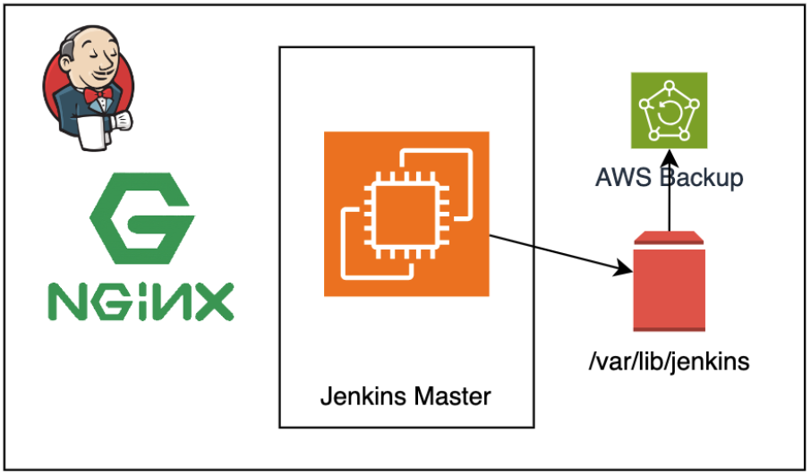
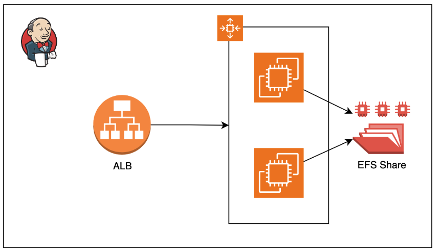
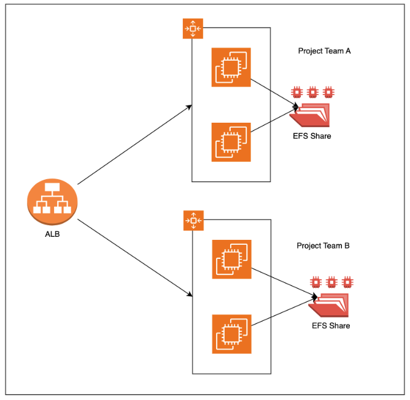

# Jenkins Controller in Production

| Revision | Change | Date | Author | Approver |
| --- | --- | --- | --- | --- |
| 0.1 | Initial Release | 25 Sept 2023 | Shoaib S. | Shoaib S. |

---

## Objective

We will look into some design considerations when deploying Jenkins Controller in High Availability Configuration.

## Challenges

Configuring Jenkins Controller in High Availability is NOT straight forward due to the following reasons:

- As demand for DevOps keeps on growing, Agile Methodologies are being baked into the systems, it is very important to have a robust, highly available, fault tolerant and scalable CICD infrastructure, similarly like the application workloads.
- DevOps engineers being scattered around the globe in different timezones, and applications being frequently released, downtime is something that is no more an option.
- Jenkins, to be specific, needs to have a volume that mounts the JENKINS_HOME directory (/var/lib/jenkins), which causes problems in scaling. This is because, usually other tools and application have a Database like MySQL or MongoDB to store data, but Jenkins has a folder that holds that data instead of a database.

## Solutions

Luckily we have solutions for these but they all have certain tradeoffs with Cost, Complexity, Performance. We will look into them one by one.

### Standalone Jenkins Controller

This is a very basic controller architecture style. In this we have:

- 1 EC2 instance (Right Sized & Benchmarked) to serve as Jenkins Controller.
- 1 EBS data volume mounted for JENKINS_HOME path.
EBS volume backups periodically.

#### Advantages

- Simple and Easy to setup.
- Can reverse proxy using nginx without need of ALB for TLS Termination.
- Support for backup and restore of EBS Volume.

#### Disadvantages

- As it is a standalone instance, loss of data or corruption will cause sever downtime.
- Even after a recovery, you will permanently lose the data from the time of last snapshot and time of failure.

### Highly Available Jenkins using ALB, ASG and EFS

In this setup we have:

- An Auto Scaling Group (ASG), to scale the Jenkins controller machines horizontally.
- An Application Load Balancer, to route and load balance traffic to backend Servers, and for TLS Termination.
- An Elastic File System (EFS), for being a shared storage solution having the JENKINS_HOME mounted and shared across multiple controller servers.

#### Advantages

- The setup is highly available as we have multiple instances of controller.
- We don’t need to worry about disk backups and recovery, as we have a shared storage solution EFS for us.

#### Disadvantages

- EFS solutions can be costlier than EBS solution along with the number of IO operations.
- EFS is designed for more Reads than Writes, whereas Jenkins tend to Write data a lot, so when there are high number of concurrent users, say > 100, we might see some lag in response.

### Separate Jenkins Controller for Teams

Finally, in this strategy, we provision seperate Jenkins controllers for separate teams based on Product, Business Units, Locations, etc then use the High Availability strategy as discussed above, to get the best of both worlds.

#### Advantages
- Combined with HA strategy discussed above, you can get a high performance Jenkins Controller for separate teams.
- Since the teams are separate, the number of concurrent users will be less, hence better performance using EFS.

#### Disadvantages
- Increased Maintainance as you will have multiple separate instance of Jenkins.
- User Authentication & Authorization will be tricky and redundant for users working on more than one projects.

## Comparison Table

| Point of comparison | Standalone |Highly Available EFS | Seperate Teams |
| --- | --- | --- | --- |
| Cost | Low | High | Higher |
| Management Overhead | Low | Moderate | High |
| Fault Tolerance | No (Downtime Expected) | Yes | Yes |
| Highly Available | No | Yes | Yes |
| Use Case |For small projects and teams, where there is high RPO & RTO permissibility. (You will lose data between last backup and point of failure). | For Small to Medium Projects, that require low RPO & RTO. | For Medium to Large Projects and teams. |

## Right Sizing

| Resource | Right Size Options |
| --- | --- |
| Compute | T- series (For small to medium size load, due to burstable nature)    M-series (For medium to heavy load) |
| Storage | Actual value depends on the use case and plugins or other data.     In general:  Worker Nodes should have more storage than Master. As the pipelines will be executed in workers and tools will be installed.

## References

- [Jenkins on AWS Whitepaper](https://d1.awsstatic.com/whitepapers/DevOps/Jenkins_on_AWS.pdf)
- [Amazon EBS Backup & Restore using AWS Backup](https://aws.amazon.com/getting-started/hands-on/amazon-ebs-backup-and-restore-using-aws-backup/)
- [Lyft AWS Case Study](https://aws.amazon.com/solutions/case-studies/lyft/)
- [Setup Higly Availabe Jenkins](https://devopscube.com/setup-highly-available-jenkins/)
- [Jenkins HA and DR on AWS](https://aws.amazon.com/blogs/devops/jenkins-high-availability-and-disaster-recovery-on-aws/)

