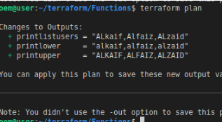

# Terraform Functions and Expressions
| Revision | Change          | Date         | Author   | Approver  |
| ---      | ---             | ---          | ---      | ---       |
| 0.1      | Initial Release | 25 Sept 2023 | Alkaif   |  |

## Objective 

Understanding Terraform Functions and Expressions

## Solutions

The Terraform language includes a number of built-in functions that you can call from within expressions to transform and combine values.

Lets see an example where we have a variable.tf file 

```
variable "users" {
    type = list
    default = ["ALkaif","Alfaiz","ALzaid"]
}
```

Now we have output.tf file where we have used some built in functions defined by terraform itself like join,upper,lower

```
output "printlistusers" {
  value = "${join(",",var.users)}"
}

output "printlower" {
  value = "${lower(join(",",var.users))}"
}

output "printupper" {
  value = "${upper(join(",",var.users))}"
}

```

## Result




In this example, we are using Terraform's built-in random_pet resource to generate a random suffix consisting of two words. 

We then use this random suffix in the aws_s3_bucket resource's bucket attribute to ensure that the S3 bucket name is unique.

 This can be useful when creating multiple S3 buckets within the same configuration, ensuring that each bucket has a unique name.

```
#provision s3 with functions

provider "aws" {
    region = "us-east-2"
}

resource "random_pet" "bucket_suffix" {
    length = 2
}

resource "aws_s3_bucket" "example" {
    bucket = "my-example-bucket-${random_pet.bucket_suffix.id}"
    acl = "private"
}

```

The random_pet resource generates a random value, and we access it using random_pet.bucket_suffix.id to concatenate it with the bucket name.

This demonstrates how Terraform's built-in functions and resources can be used to create dynamic and unique resource names in AWS infrastructure provisioning.

## Refrences

[developer.hashicorp.com/](https://developer.hashicorp.com/terraform/language/functions)

[Walk-through-common-use-cases-for-built-in-Terraform-functions](https://www.techtarget.com/searchitoperations/tutorial/Walk-through-common-use-cases-for-built-in-Terraform-functions)

