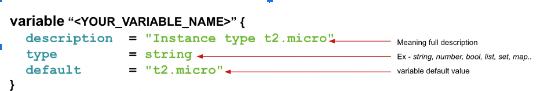

# Understanding Variables and Data Types

| Revision | Change          | Date         | Author   | Approver  |
| ---      | ---             | ---          | ---      | ---       |
| 0.1      | Initial Release | 25 Sept 2023 | Alkaif   |  |


---

Terraform variables are a way to store values that can be reused throughout your Terraform configuration.




Here is the main.tf which we are going to parameterize using terraform variables.

```
provider "aws" {
   region     = "eu-central-1"
   access_key = "<INSERT_YOUR_ACCESS_KEY>"
   secret_key = "<INSERT_YOUR_SECRET_KEY>"
}

resource "aws_instance" "ec2_example" {

   ami           = "ami-0767046d1677be5a0"
   instance_type =  var.instance_type

   tags = {
           Name = "Terraform EC2"
   }
}

variable "instance_type" {
   description = "Instance type t2.micro" 
   type        = string
   default     = "t2.micro"
}

```

## Data Types

Terraform variables can have various types such as string, number, boolean, list, map etc.

### string variable type 

The string type is used to store a sequence of characters (text).

We are going parameterized instance_type = "t2.micro"

```
provider "aws" {
   region     = "eu-central-1"
   access_key = "<INSERT_YOUR_ACCESS_KEY>"
   secret_key = "<INSERT_YOUR_SECRET_KEY>"
}

resource "aws_instance" "ec2_example" {

   ami           = "ami-0767046d1677be5a0"
   instance_type =  var.instance_type

   tags = {
           Name = "Terraform EC2"
   }
}

variable "instance_type" {
   description = "Instance type t2.micro"
   type        = string
   default     = "t2.micro"
}
```
### Number variable type 

Integer variables hold values that have no fractional part (that is, whole numbers only)

We are going parameterized instance_count = 2

```
provider "aws" {
   region     = "eu-central-1"
   access_key = "<INSERT_YOUR_ACCESS_KEY>"
   secret_key = "<INSERT_YOUR_SECRET_KEY>"
}

resource "aws_instance" "ec2_example" {

   ami           = "ami-0767046d1677be5a0"
   instance_type =  "t2.micro"
   count = var.instance_count

   tags = {
           Name = "Terraform EC2"
   }
}

variable "instance_count" {
  description = "EC2 instance count"
  type        = number
  default     = 2
}
```

### Boolean variable type

The bool variable can be used to set true or false values inside your terraform file.

We are going parameterized enable_public_ip = false

```
variable "enable_public_ip" {
  description = "Enable public IP address"
  type        = bool
  default     = true
}
```

```
provider "aws" {
   region     = "eu-central-1"
   access_key = "<INSERT_YOUR_ACCESS_KEY>"
   secret_key = "<INSERT_YOUR_SECRET_KEY>"
}
resource "aws_instance" "ec2_example" {

   ami           = "ami-0767046d1677be5a0"
   instance_type =  "t2.micro"
   count = 1
  associate_public_ip_address = var.enable_public_ip

   tags = {
           Name = "Terraform EC2"
   }

}
variable "enable_public_ip" {
  description = "Enable public IP address"
  type        = bool
  default     = true
}
```

### List variable type

As the name suggests we are going to define a list that will contain more than one element in it.

```
variable "user_names" {
  description = "IAM usernames"
  type        = list(string)
  default     = ["user1", "user2", "user3s"]
}
```
```
provider "aws" {
   region     = "eu-central-1"
   access_key = "<INSERT_YOUR_ACCESS_KEY>"
   secret_key = "<INSERT_YOUR_SECRET_KEY>"
}
resource "aws_instance" "ec2_example" {

   ami           = "ami-0767046d1677be5a0"
   instance_type =  "t2.micro"
   count = 1

   tags = {
           Name = "Terraform EC2"
   }
}
resource "aws_iam_user" "example" {
  count = length(var.user_names)
  name  = var.user_names[count.index]
}
variable "user_names" {
  description = "IAM usernames"
  type        = list(string)
  default     = ["user1", "user2", "user3s"]
}
```
### Map variable type

Terraform also supports the map variable type where you can define the key-value pair.

Let's take an example where we need to define a project and environment, so we can use the map variable to achieve that.

```
variable "project_environment" {
  description = "project name and environment"
  type        = map(string)
  default     = {
    project     = "project-alpha",
    environment = "dev"
  }
}
```
```
provider "aws" {
   region     = "eu-central-1"
   access_key = "<INSERT_YOUR_ACCESS_KEY>"
   secret_key = "<INSERT_YOUR_SECRET_KEY>"
}
resource "aws_instance" "ec2_example" {

   ami           = "ami-0767046d1677be5a0"
   instance_type =  "t2.micro"

   tags = var.project_environment

}


variable "project_environment" {
  description = "project name and environment"
  type        = map(string)
  default     = {
    project     = "project-alpha",
    environment = "dev"
  }
}


```


