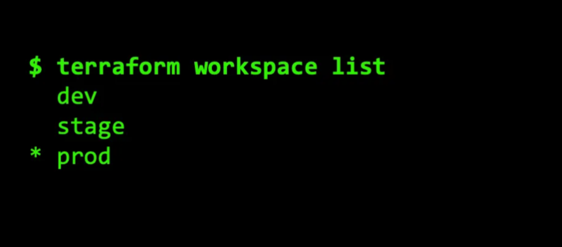
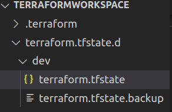
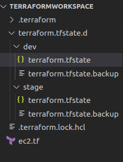

# Workspace

| Revision | Change          | Date         | Author   | Approver  |
| ---      | ---             | ---          | ---      | ---       |
| 0.1      | Initial Release | 25 Sept 2023 | Alkaif   |  |

## Objectives

Setting up environments using workspaces

## problem statement

The problem at hand is to design and implement a solution for setting up environments using workspaces. 

## Solutions



Workspaces allows you to separate your state and infrastructure without changing anything in your code when you wanted the same exact code base to deploy to multiple environments without overlap. i.e. Workspaces help to create multiple state files for set of same terraform configuration files.

Example

```
provider "aws" {
  region = "us-east-2"
}
resource "aws_instance" "example" {
  ami           = "ami-0fb653ca2d3203ac1"
  instance_type = "t2.micro"
  tags = {
    Name = "example-server"
  }
}
```

This code deploys a single virtual server, called an EC2 instance, in AWS in the us-east-2 (Ohio) region and gives it the name tag example-server.

Now, imagine you want to deploy this server in three environments: dev, stage, prod. To do this using workspaces, you first create a workspace called dev using the terraform workspace new command:

```
terraform workspace new dev
```

And now you can deploy the server in dev using terraform apply

You can see now there is a dev Dir containing with  completely separate terraform.tfstate



To deploy to staging, you create a new workspace called stage:

```
terraform workspace new stage
```

And now you can deploy the server in stage using terraform apply

You can see now there is a stage Dir containing with  completely separate terraform.tfstate



Even though you just deployed an EC2 instance in dev, the plan output shows Terraform wants to deploy a totally new EC2 instance. That’s because you’re now in the stage workspace, so Terraform is using a separate state file, and knows nothing about the instance already deployed in dev

## Switching between environments

To switch between environments, you need to switch between workspaces using CLI commands. You can see all your workspaces using the terraform workspace list command:

```
terraform workspace list
```

```
terraform workspace select dev
```

## Refrences

[blog.gruntwork.io](https://blog.gruntwork.io/how-to-manage-multiple-environments-with-terraform-using-workspaces-98680d89a03e)

[medium](https://medium.com/devops-mojo/terraform-workspaces-overview-what-is-terraform-workspace-introduction-getting-started-519848392724)

[spacelift.io](https://spacelift.io/blog/terraform-environments)