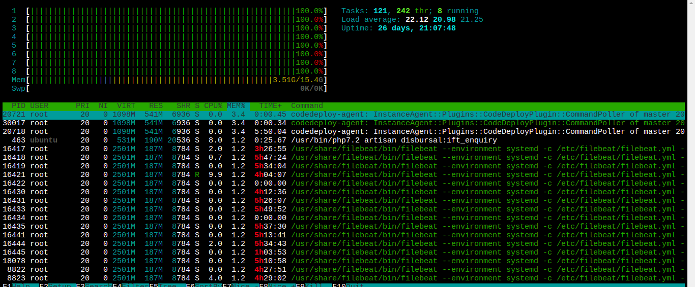

# MARKDOWN

This document gives a brief cheat sheet of using Markdown (.md) language for documentation.

## Headings

Use "#" for declaring headings

```plain
#   Heading 1
##  Heading 2
### Heading 3
```

## Text Style Manipulations

| Syntax | Output |
| --- | --- |
| `**Bold**` | **Bold** |
| `*Italics*` | *Italics* |
| `~~Strike Through~~` | ~~Strike Through~~ |

## Code

You can use ``` for opening and closing the code snippet section.

`You can use ```your multiline code ``` `

For example, for python you can write

_main.py_
```python
def print_message(msg):
  print(msg)

print_message('Hello from RnD')
```

Executing the code:
```bash
$ python3 main.py
$ Hello from RnD
```

## Table

You can create a table simply by using '|' and '-'.

For eg., to create a table showing name and designation of employee:

```
| Name | Designation |           <== Table heading
| --- | --- |                    <== Seperator
| Vishal Shinde | DevOps HOD |   <== data rows
| Rugved Shinde | HRBP |
```

Output

| Name | Designation |
| --- | --- |
| Vishal Shinde | DevOps HOD |
| Rugved Shinde | HRBP |

## Filenames/As-is-names

You can use single backticks (`) for names that are meant to be as-is like filenames, variable names, person name, etc.

Example

```
To configure virtual hosting you need to create a file, say `abc.com.conf` in the `/etc/nginx/conf.d` directory.
```

Output

To configure virtual hosting you need to create a file, say `abc.com.conf` in the `/etc/nginx/conf.d` directory.

## Links

You will need this to attach screenshots of your PoCs or any other purpose.

You will need a title of the image in the square bracket `[]` and then the link to the file or image in round brackets `()`

For example:
```
Please refer this [Link](./MARKDOWN.md#images--links)
```

Output

Please refer this [Link](./MARKDOWN.md#images--links)

## Images

Same as links but just add '!' before the square brackets

```
Please find the htop screenshot below


```

Output

Please find the htop screenshot below


## Equations

### Inline

You can use '$' at start and end.

For example
```
This sentence uses `$` delimiters to show math inline:  $\sqrt{3x-1}+(1+x)^2$
```

Output

This sentence uses `$` delimiters to show math inline:  $\sqrt{3x-1}+(1+x)^2$

### Block

To add a math expression as a block, start a new line and delimit the expression with two dollar symbols $$.

```
**The Cauchy-Schwarz Inequality**
$$\left( \sum_{k=1}^n a_k b_k \right)^2 \leq \left( \sum_{k=1}^n a_k^2 \right) \left( \sum_{k=1}^n b_k^2 \right)$$
```

Output

**The Cauchy-Schwarz Inequality**
$$\left( \sum_{k=1}^n a_k b_k \right)^2 \leq \left( \sum_{k=1}^n a_k^2 \right) \left( \sum_{k=1}^n b_k^2 \right)$$

